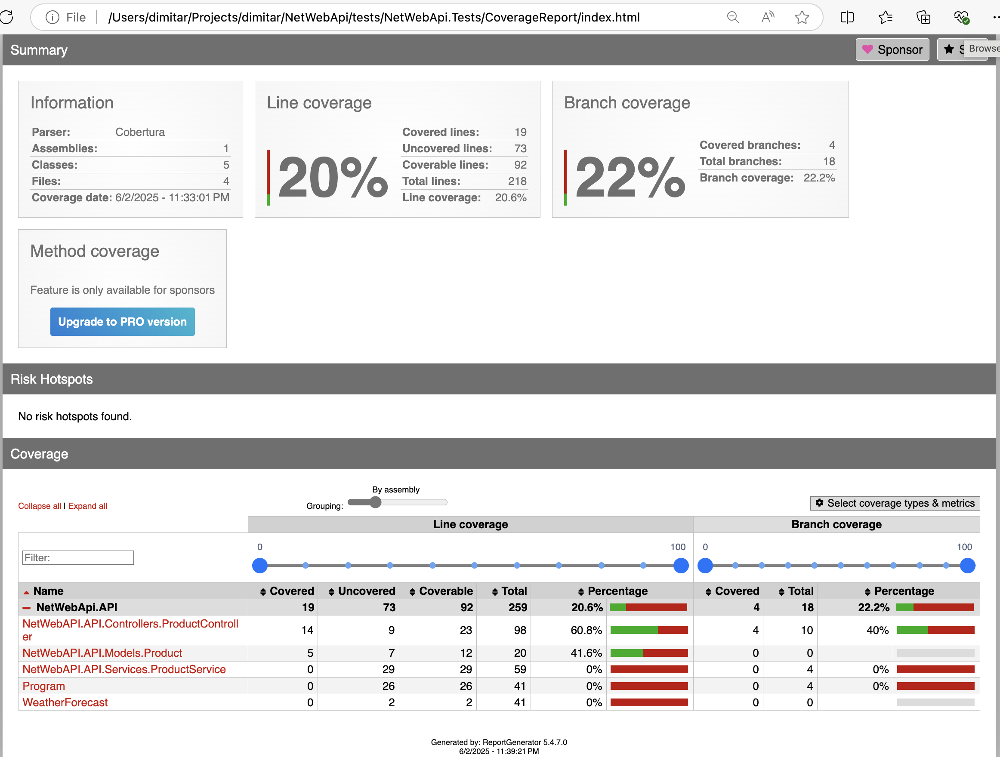

# xUnit and mock tests

The ProductController uses dependency injection which enables replacing of IProductService with a Mock service in the tests.

## Run tests

Simple tests execution

```sh
❯ dotnet test

Restore complete (0.3s)
  NetWebApi.API succeeded (0.2s) → /Users/dimitar/Projects/NetWebApi/src/NetWebApi.API/bin/Debug/net9.0/NetWebApi.API.dll
  NetWebApi.Tests succeeded (0.2s) → bin/Debug/net9.0/NetWebApi.Tests.dll
[xUnit.net 00:00:00.00] xUnit.net VSTest Adapter v2.8.2+699d445a1a (64-bit .NET 9.0.5)
[xUnit.net 00:00:00.03]   Discovering: NetWebApi.Tests
[xUnit.net 00:00:00.05]   Discovered:  NetWebApi.Tests
[xUnit.net 00:00:00.05]   Starting:    NetWebApi.Tests
[xUnit.net 00:00:00.11]   Finished:    NetWebApi.Tests
  NetWebApi.Tests test succeeded (0.5s)

Test summary: total: 5, failed: 0, succeeded: 5, skipped: 0, duration: 0.5s
Build succeeded in 1.6s
```

Run tests with verbose logging

```sh
❯ dotnet test --logger "console;verbosity=detailed"

Restore complete (0.3s)
  NetWebApi.API succeeded (0.2s) → /Users/dimitar/Projects/NetWebApi/src/NetWebApi.API/bin/Debug/net9.0/NetWebApi.API.dll
  NetWebApi.Tests succeeded (0.2s) → bin/Debug/net9.0/NetWebApi.Tests.dll
A total of 1 test files matched the specified pattern.
/Users/dimitar/Projects/NetWebApi/tests/NetWebApi.Tests/bin/Debug/net9.0/NetWebApi.Tests.dll
[xUnit.net 00:00:00.00] xUnit.net VSTest Adapter v2.8.2+699d445a1a (64-bit .NET 9.0.5)
[xUnit.net 00:00:00.00] xUnit.net VSTest Adapter v2.8.2+699d445a1a (64-bit .NET 9.0.5)
[xUnit.net 00:00:00.04]   Discovering: NetWebApi.Tests
[xUnit.net 00:00:00.04]   Discovering: NetWebApi.Tests
[xUnit.net 00:00:00.05]   Discovered:  NetWebApi.Tests
[xUnit.net 00:00:00.05]   Discovered:  NetWebApi.Tests
[xUnit.net 00:00:00.05]   Starting:    NetWebApi.Tests
[xUnit.net 00:00:00.05]   Starting:    NetWebApi.Tests
[xUnit.net 00:00:00.12]   Finished:    NetWebApi.Tests
[xUnit.net 00:00:00.12]   Finished:    NetWebApi.Tests
  Passed NetWebApi.Tests.ProductControllerTests.GetProductById_ReturnsOkResult_WithProduct [40 ms]
  Passed NetWebApi.Tests.ProductControllerTests.GetAllProducts_ReturnsOkResult_WithProductList [2 ms]
  Passed NetWebApi.Tests.ProductControllerTests.DeleteProduct_ReturnsNoContent_WhenProductExists [1 ms]
  Passed NetWebApi.Tests.ProductControllerTests.AddProduct_ReturnsCreatedAtActionResult_WithNewProduct [3 ms]
  Passed NetWebApi.Tests.ProductControllerTests.DeleteProduct_ReturnsNotFound_WhenProductDoesNotExist [< 1 ms]

Test Run Successful.
Total tests: 5
     Passed: 5
 Total time: 0.3641 Seconds
  NetWebApi.Tests test succeeded (0.5s)

Test summary: total: 5, failed: 0, succeeded: 5, skipped: 0, duration: 0.5s
Build succeeded in 1.5s
```

Run a Specific Test

```sh
❯ dotnet test --filter "FullyQualifiedName~ProductControllerTests"

Restore complete (0.3s)
  NetWebApi.API succeeded (0.2s) → /Users/dimitar/Projects/NetWebApi/src/NetWebApi.API/bin/Debug/net9.0/NetWebApi.API.dll
  NetWebApi.Tests succeeded (0.2s) → bin/Debug/net9.0/NetWebApi.Tests.dll
[xUnit.net 00:00:00.00] xUnit.net VSTest Adapter v2.8.2+699d445a1a (64-bit .NET 9.0.5)
[xUnit.net 00:00:00.03]   Discovering: NetWebApi.Tests
[xUnit.net 00:00:00.05]   Discovered:  NetWebApi.Tests
[xUnit.net 00:00:00.05]   Starting:    NetWebApi.Tests
[xUnit.net 00:00:00.11]   Finished:    NetWebApi.Tests
  NetWebApi.Tests test succeeded (0.5s)

Test summary: total: 5, failed: 0, succeeded: 5, skipped: 0, duration: 0.5s
Build succeeded in 1.6s
```

## Test coverage

Run Tests with Coverage Report

```sh
❯ dotnet test --collect:"XPlat Code Coverage"

Restore complete (0.3s)
  NetWebApi.API succeeded (0.2s) → /Users/dimitar/Projects/dimitar/NetWebApi/src/NetWebApi.API/bin/Debug/net9.0/NetWebApi.API.dll
  NetWebApi.Tests succeeded (0.2s) → bin/Debug/net9.0/NetWebApi.Tests.dll
[xUnit.net 00:00:00.00] xUnit.net VSTest Adapter v2.8.2+699d445a1a (64-bit .NET 9.0.5)
[xUnit.net 00:00:00.03]   Discovering: NetWebApi.Tests
[xUnit.net 00:00:00.04]   Discovered:  NetWebApi.Tests
[xUnit.net 00:00:00.04]   Starting:    NetWebApi.Tests
[xUnit.net 00:00:00.10]   Finished:    NetWebApi.Tests
  NetWebApi.Tests test succeeded (1.0s)

Test summary: total: 5, failed: 0, succeeded: 5, skipped: 0, duration: 0.9s
Build succeeded in 2.0s

Attachments:
  /Users/dimitar/Projects/dimitar/NetWebApi/tests/NetWebApi.Tests/TestResults/0da9afa4-aa3f-45e3-b662-31ac08cf4d53/coverage.cobertura.xml
```

Convert Coverage Report to Readable Format

```sh
> dotnet tool install --global dotnet-reportgenerator-globaltool --version 5.4.7
You can invoke the tool using the following command: reportgenerator
Tool 'dotnet-reportgenerator-globaltool' (version '5.4.7') was successfully installed.
```

Generate the HTML report

```sh
> ~/.dotnet/tools/reportgenerator -reports:TestResults/**/coverage.cobertura.xml -targetdir:CoverageReport
2025-06-02T23:39:21: Arguments
2025-06-02T23:39:21:  -reports:TestResults/**/coverage.cobertura.xml
2025-06-02T23:39:21:  -targetdir:CoverageReport
2025-06-02T23:39:21: Writing report file 'CoverageReport/index.html'
2025-06-02T23:39:21: Report generation took 0.1 seconds
```

Open the report

```sh
> start CoverageReport/index.html
```

